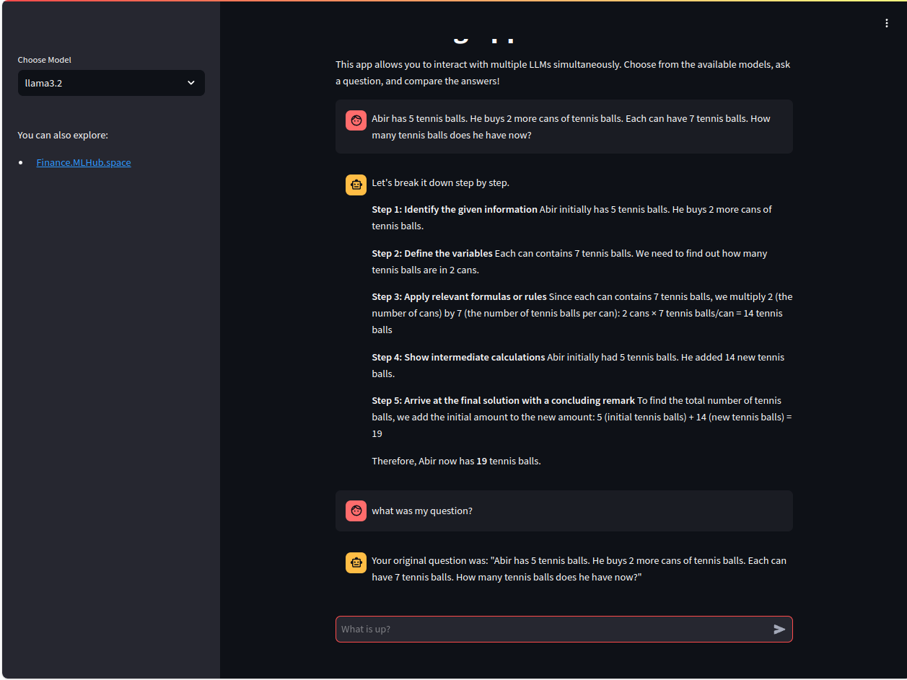

# ML Hub - Dockerized Deployment

## Overview

This project provides a containerized environment for running a Streamlit-based LLM Hub application alongside an Ollama LLM model server, with an Nginx reverse proxy handling incoming requests. The deployment is managed using Docker Compose.

## Architecture

- Nginx Proxy: Acts as a reverse proxy for routing requests to the appropriate services.
- LLM Hub (Streamlit App): Serves the user interface for interacting with the language model.
- Ollama Server: Runs the language model and processes user queries.

## Prerequisites

Ensure you have the following installed:

- [Docker](https://docs.docker.com/get-started/get-docker/)
- [Docker Compose](https://docs.docker.com/compose/install/)
- NVIDIA drivers (if using GPU acceleration for Ollama)

## Setup

1.  **Clone the repository:**

    ```code
    git clone https://github.com/NiloyKumarKundu/mlhub.space.git
    cd LLM_Hub
    ```

2.  **Configure Environment Variables:** Create a .env file in the project root and define the required environment variables:

    ```
    STREAMLIT_SERVER_ADDRESS=0.0.0.0
    STREAMLIT_SERVER_PORT=8501
    VIRTUAL_HOST=your.domain.com
    NGINX_SSL_PATH=/path/to/ssl
    NGINX_LOGS_PATH=/path/to/nginx/logs
    APP_LOGS_PATH=/path/to/app/logs
    OLLAMA_CONFIG_PATH=/path/to/ollama/config
    NVIDIA_VISIBLE_DEVICES=all # For GPU support
    NVIDIA_DRIVER_CAPABILITIES=compute,utility
    ```

    Additionally, inside the `LLM_Hub` folder, create a `.env` file and specify the following:

    ```
    LANGSMITH_API_KEY=your_langsmith_api_key
    LANGCHAIN_PROJECT=your_langchain_project
    ```

3.  **Build and Start the Containers:**
    ```
    docker-compose --env-file .env up --build -d
    ```

## Services

- Nginx Proxy

  - Image: `jwilder/nginx-proxy`
  - Ports: `80` (HTTP), `443` (HTTPS)
  - Handles request routing and SSL termination

- LLM Hub (Streamlit App)

  - Built from `./LLM_Hub`
  - Accessible via `http://your.domain.com`
  - Logs stored at `${APP_LOGS_PATH}`

- Ollama LLM Server
  - Image: `ollama/ollama:latest`
  - GPU support enabled (if configured)
  - Configuration stored at `${OLLAMA_CONFIG_PATH}`

## Managing the Deployment

### Start Services

    docker-compose --env-file .env up -d

### Stop Services

    docker-compose --env-file .env down

### View Logs

    docker-compose logs -f

### Rebuild Services

    docker-compose --env-file .env up --build -d

## Post-Deployment Configuration

After successfully running the Docker containers, you must install LLMs using Ollama. Follow these steps:

1.  Access the running Ollama container interactively:

        docker exec -it ollama /bin/bash

2.  Install the desired LLM. For example, to install llama3.2, run:

        ollama run llama3.2

3.  Once downloaded, the model is ready for use. Repeat the process to install additional LLMs as needed.

## Screenshots

Include relevant screenshots of the application interface to help visualize the system in action.

- Site User Interface Overview
  
- Developer Information Retrieval via System Prompt
  
- Context-Aware AI Conversation Based on Prior Input
  

## Notes

- Ensure that the virtual host (`VIRTUAL_HOST`) is correctly configured for Nginx to route traffic.

- If using GPU acceleration, install the necessary NVIDIA drivers and ensure Docker has access to the GPU.

- SSL certificates should be placed in the `${NGINX_SSL_PATH}` directory for secure HTTPS access.

- The `.env` file inside `LLM_Hub` must contain `LANGSMITH_API_KEY` and `LANGCHAIN_PROJECT` for proper integration with LangSmith and LangChain.

## License

This project is licensed under the MIT License.

---

## Contact

For inquiries, contact: [niloykk.connect@gmail.com](mailto:niloykk.connect@gmail.com)

For any issues, open a GitHub issue in the repository.
